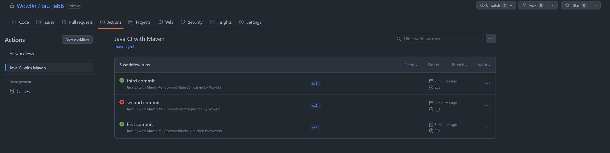
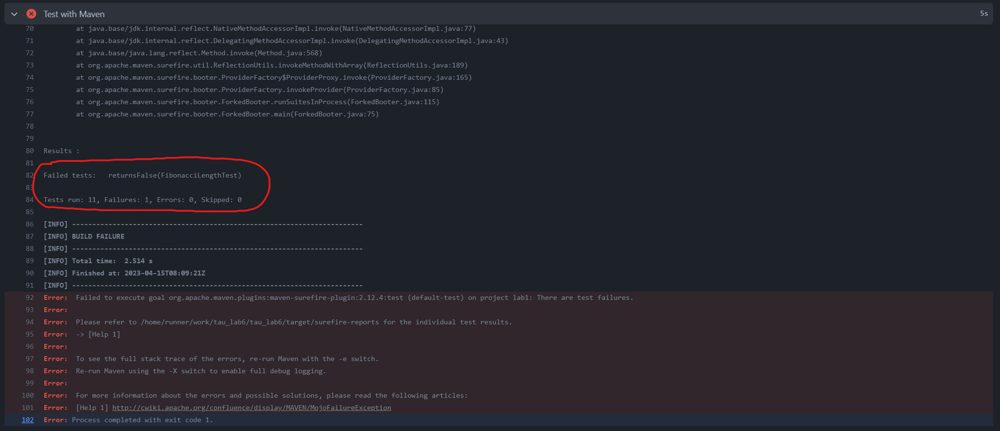

# Zadanie 6 ➜ github actions

Zadanie rozwiązałem na prywatnym repozytorium, do którego skopiowałem kod z pierwszego laboratorium.
Po dodaniu do repozytorium akcji "Java with Maven" napisałem następujący skrypt:

```
name: Java CI with Maven

on:
  push:
    branches: [ "main" ]
  pull_request:
    branches: [ "main" ]

jobs:
  first_job:
    runs-on: ubuntu-latest

    steps:
      - name: Download repository
        uses: actions/checkout@v2

      - name: Set up JDK 17
        uses: actions/setup-java@v1
        with:
          java-version: 17

      - name: Cache Maven packages
        uses: actions/cache@v2
        with:
          path: ~/.m2
          key: ${{ runner.os }}-m2-${{ hashFiles('**/pom.xml') }}
          restore-keys: ${{ runner.os }}-m2

      - name: Test with Maven
        run: mvn -B test --file pom.xml
```
Tworzy on akcje przy każdym pushu lub pull requeście na repozytorium, która po pobraniu i zcashowaniu dependencji Mavena przeprowadza wszystkie testy znajdujące się w projekcie.

---

Zpushowane zostały 3 commity

---
- pierwszy jest niezmienionym kodem ze zadania 1, wszystko przeszło bez błedów
- w drugim commicie dodałem test, który zwraca *false*
    ```
    @Test
    public void returnsFalse(){
        assert(false);
    }
    ```
  Wywołało to błąd
  
- w trzecim commicie usunałem dodaną funkcję, testy przeszły ponownie pomyślnie